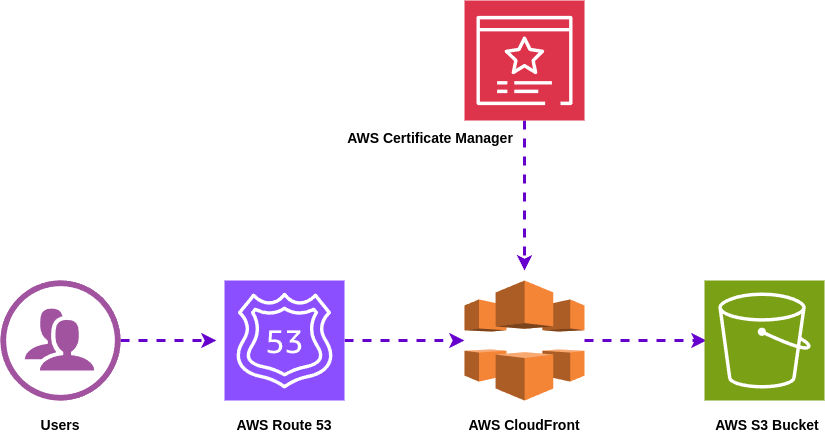

# **AWS CloudFront with S3 Static Website Hosting**

## **Step 1: Create and Configure S3 Bucket**
1. Create an S3 bucket with the name like, `nasirtechtalks.xyz`.
2. Upload your static website files to the bucket.
3. Enable **Static Website Hosting** from the bucket's **Properties**:
   - Specify the default root object (e.g., `index.html`).
   - Note the **Bucket Website Endpoint** for later use.

## **Step 2: Configure Route 53 Hosted Zone**
1. Go to **Route 53** and create a **Hosted Zone** for your domain like, `nasirtechtalks.xyz`.
2. Update your domain's DNS settings with the **AWS Name Servers** provided in the Hosted Zone.
3. Verify the name servers using a DNS checker to ensure proper configuration.

## **Step 3: Request an SSL Certificate**
1. Go to **AWS Certificate Manager (ACM)** and request an SSL certificate for your domain like,`nasirtechtalks.xyz`.
2. Complete **Domain Validation** using DNS validation or email validation.
3. After validation, your SSL certificate will be issued by ACM.

## **Step 4: Set Up CloudFront Distribution**
1. **Create a CloudFront distribution**:
   - In the **Origin domain**, select your S3 bucket name: like, `nasirtechtalks.xyz.s3.us-east-1.amazonaws.com`.
   - Enable **Origin Access Control (OAC)** and create a new OAC.
   - Initially, keep **Web Application Firewall (WAF)** disabled.

2. Configure the distribution settings:
   - **Alternate Domain Name (CNAME)**: Add your domain name like, `nasirtechtalks.xyz`.
   - **Custom SSL Certificate**: Select the SSL certificate you created in ACM.
   - **Default Root Object**: Set it to `index.html`.

3. After creating the distribution, a bucket policy will be generated. Copy the policy.

4. **Update S3 Bucket Permissions**:
   - Go to the **Permissions** section of your S3 bucket.
   - Paste the bucket policy from CloudFront and save it.

## **Step 5: Update Route 53 DNS Records**
1. Go to **Route 53 Dashboard** and select your Hosted Zone.
2. Create an **A Record**:
   - Enable **Alias** and select **Alias to CloudFront distribution**.
   - Choose your CloudFront distribution (`d3no5q6230ppjl.cloudfront.net`).
3. Save the record.

## **Step 6: Browse Your Static Website**
- Open your browser and navigate to your domain like, `nasirtechtalks.xyz` to view your static website hosted on S3 and served via CloudFront.

## **Diagram**

  
   
  Pic: Static website hosting on Amazon S3 with CloudFront

