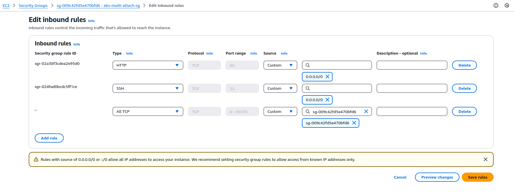
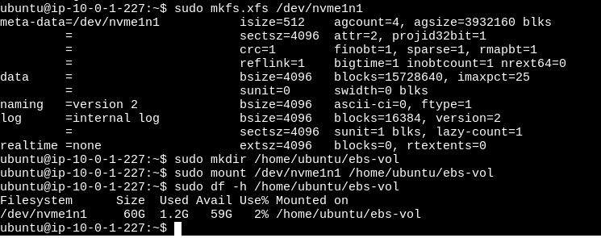
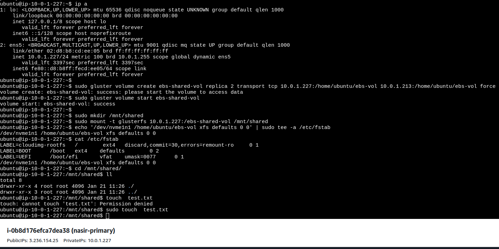
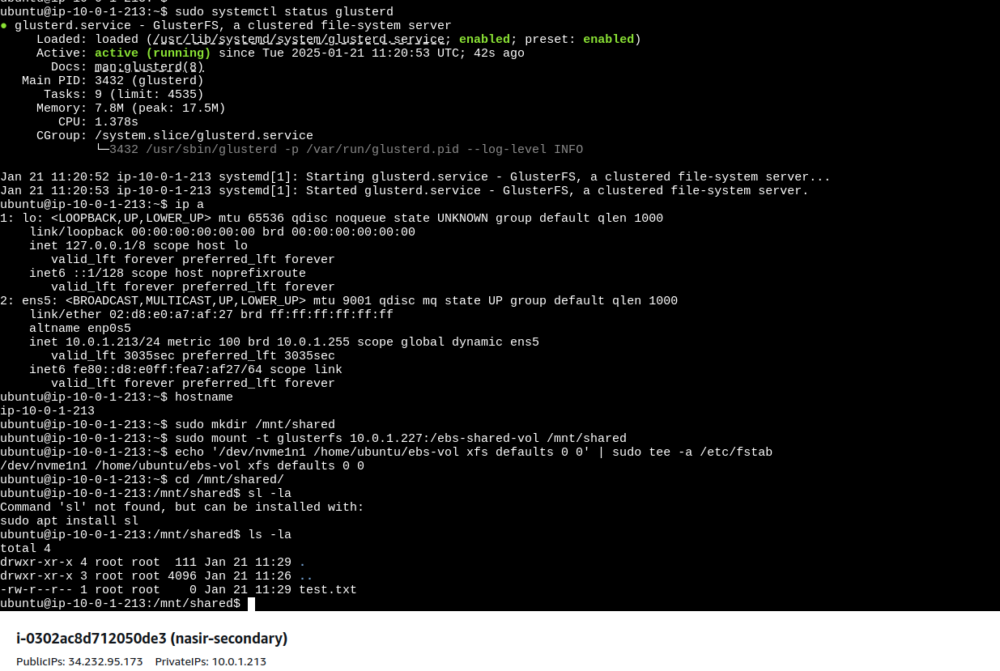

<h2> Setting Up a GlusterFS Cluster on AWS EC2 with EBS Multi-Attach for Data Replication </h2>

This guide walks you through setting up a replicated GlusterFS cluster using AWS EC2 instances and EBS volumes with Multi-Attach support. This setup provides high availability and shared storage across multiple instances.

**Table of Contents**
- [GlusterFS](#glusterfs)
- [EBS Multi-Attach](#ebs-multi-attach)
- [Key Benefits of EBS Multi-Attach with Synchronization](#key-benefits-of-ebs-multi-attach-with-synchronization)
  - [Prerequisites](#prerequisites)
- [Steps 1 Create Two EC2 Instances and One EBS Volumes](#steps-1-create-two-ec2-instances-and-one-ebs-volumes)
  - [1. Create EC2 Instances and EBS Volumes](#1-create-ec2-instances-and-ebs-volumes)
- [Steps 2: Format and Mount EBS Volumes](#steps-2-format-and-mount-ebs-volumes)
  - [2.1 Verify EBS Volume Connection](#21-verify-ebs-volume-connection)
  - [2.2 Format the EBS Volume from Primary](#22-format-the-ebs-volume-from-primary)
  - [2.3 Mount the EBS Volume both (Primary \& Secondary) EC2 Instance](#23-mount-the-ebs-volume-both-primary--secondary-ec2-instance)
- [Steps 3: Install GlusterFS](#steps-3-install-glusterfs)
  - [3.1 Install GlusterFS on Both Instances](#31-install-glusterfs-on-both-instances)
  - [3.2 Start GlusterFS Service on Both Instances](#32-start-glusterfs-service-on-both-instances)
- [Steps 4: Set Up GlusterFS Cluster](#steps-4-set-up-glusterfs-cluster)
  - [4.1 Setup GlusterFS Cluster shared directory ownsership and environment defaults, both Primary and Secondary Server.](#41-setup-glusterfs-cluster-shared-directory-ownsership-and-environment-defaults-both-primary-and-secondary-server)
  - [4.2 Peer Probe from Primary](#42-peer-probe-from-primary)
- [Steps 5: Create GlusterFS Volume](#steps-5-create-glusterfs-volume)
  - [5.1 Create Shared Volume from Primary](#51-create-shared-volume-from-primary)
  - [5.2 Start the GlusterFS Volume from Primary](#52-start-the-glusterfs-volume-from-primary)
- [Steps 6: Mount GlusterFS Volume Both Instances](#steps-6-mount-glusterfs-volume-both-instances)
  - [6.1 Mount the GlusterFS Volume on Both Instances](#61-mount-the-glusterfs-volume-on-both-instances)
- [Steps 7: Auto-Mount EBS Volume on Reboot](#steps-7-auto-mount-ebs-volume-on-reboot)
  - [7.1 Add to `/etc/fstab`](#71-add-to-etcfstab)
  - [7.2 File Synchronization Between Primary and Secondary Nodes](#72-file-synchronization-between-primary-and-secondary-nodes)
  - [7.3 Monitoring GlusterFS Volume](#73-monitoring-glusterfs-volume)
  - [7.4 These commands should help you troubleshoot](#74-these-commands-should-help-you-troubleshoot)
- [Conclusion](#conclusion)


## GlusterFS
GlusterFS is an open-source, distributed file system that aggregates storage resources from multiple servers into a unified pool. It is scalable, fault-tolerant, and well-suited for applications requiring high availability and performance, such as cloud storage and big data solutions.

## EBS Multi-Attach
EBS Multi-Attach is a feature of Amazon Elastic Block Store (EBS) that allows a single EBS volume to be simultaneously attached to multiple EC2 instances within the same availability zone. This capability is particularly beneficial for clustered applications like GlusterFS, as it enables shared storage access while maintaining consistency and reliability.

## Key Benefits of EBS Multi-Attach with Synchronization

- **High Availability**: Data remains accessible from multiple EC2 instances, ensuring continuous availability even during instance failures.

- **Performance**:  Each EC2 instance attached to the EBS volume achieves full performance, reducing bottlenecks and improving throughput.

- **Consistency**:  Changes made on one node are immediately reflected across all attached instances, maintaining data consistency.

- **Fault Tolerance**:  The system can tolerate instance or network failures without affecting data accessibility due to data redundancy across nodes.

- **Real-Time Synchronization**:  Instantly synchronizes changes between nodes, ensuring all attached instances have up-to-date data for seamless operation.


### Prerequisites

- Minimum 2 EC2 instances.
- Supported EC2 instances include:
  - **General Purpose**: `m5`, `m5d`, `m5a`, `m5ad`, `m5n`, `m5dn`, `m6i`, `m6id`.
  - **Compute Optimized**: `c5`, `c5d`, `c5a`, `c5ad`, `c5n`, `c6i`, `c6id`.
  - **Memory Optimized**: `r5`, `r5d`, `r5a`, `r5ad`, `r5n`, `r5dn`, `r6i`, `r6id`.
  - **Storage Optimized**: `i3en`, `i4i`.
  - **Accelerated Computing**: `p3dn.24xlarge`, `p4d`.
- Security group allowing GlusterFS ports (24007-24008) between both EC2 instances.
- Both instances must be in the same AWS region and availability zone.
- Tested on AWS Provided Ubuntu 24.04 LTS.
- EBS volume type: **Provisioned IOPS SSD (io2)** to support Multi-Attach.
- SSH access to EC2 instances (ensure both instances have public IPs).
- External EBS Multi-Attach enabled for volumes.


## Steps 1 Create Two EC2 Instances and One EBS Volumes

### 1. Create EC2 Instances and EBS Volumes

1.1 **Create Security Group**
- Create a security group that allows inbound traffic on ports 80, 443, and 22, along with any other required ports.
- Next, edit security groups to allow all TCP traffic between instances using the same security group.
- Initially, allow all TCP ports for unrestricted communication between the two EC2 instances.
- Later, refine the configuration by limiting traffic to the exact required ports.

<p align="center">
  
  <br/>
  Pic: Allow all TCP ports for unrestricted communication between the two EC2 instances
</p>

1.2 **Create Two EC2 Instances**
- Create two EC2 instances in the same region and availability zone.
- Assign public IPs to both instances for SSH access.

1.3 **Create One EBS Volume**
- Create an **io2** EBS volume in the same availability zone as the EC2 instances.
- Enable **Multi-Attach** for the volume.

1.4 **Attach EBS Volume to Both Instances**
- Attach the created EBS volume to both instances.

## Steps 2: Format and Mount EBS Volumes  

### 2.1 Verify EBS Volume Connection  
- SSH into both EC2 instances.  
- Verify the EBS volume is connected by running the following command:\
`sudo lsblk`
- Ensure that the volume is attached to the instance.
    

### 2.2 Format the EBS Volume from Primary  

- Format the EBS volume only once on either of the instances (this is for the shared file system):\
**Replace 'nvme1n1' with your disk name**  
`sudo mkfs.xfs /dev/nvme1n1`


### 2.3 Mount the EBS Volume both (Primary & Secondary) EC2 Instance

- Create a directory to mount the EBS volume:\
  `sudo mkdir /home/ubuntu/ebs-vol`
- Mount the EBS volume to the newly created directory:\
  `sudo mount /dev/nvme1n1 /home/ubuntu/ebs-vol`
- Verify the mount:\
  `sudo df -h /home/ubuntu/ebs-vol`

<p align="center">
  
  <br/>
  Pic: Formate and mount volume
</p>


## Steps 3: Install GlusterFS

### 3.1 Install GlusterFS on Both Instances

-   Add the GlusterFS repository and install the GlusterFS server package:
    
    ```bash
    sudo add-apt-repository ppa:gluster/glusterfs-10
    sudo apt-get update
    sudo apt-get install -y glusterfs-server
    
    ```

### 3.2 Start GlusterFS Service on Both Instances

-   Start the GlusterFS service on both instances:
    
    ```bash
    sudo systemctl start glusterd
    sudo systemctl enable glusterd
    sudo systemctl daemon-reload
    sudo systemctl restart glusterd
    sudo systemctl status glusterd
    ```
## Steps 4: Set Up GlusterFS Cluster

### 4.1 Setup GlusterFS Cluster shared directory ownsership and environment defaults, both Primary and Secondary Server.

`sudo chown -R gluster:gluster /home/ubuntu/ebs-vol`


Uncomments `GLUSTERD_OPTIONS=''`\
`sudo vim /etc/default/glusterd`

### 4.2 Peer Probe from Primary

-   Choose one instance as the primary and the other as the secondary.
    
-   On the **primary instance**, run the following command to add the secondary instance to the cluster:
    
    `sudo gluster peer probe <secondary_instance_privateIP>`

    `sudo gluster peer probe 10.0.1.213`
    
-   If successful, the output will display: `Success`.
    
## Steps 5: Create GlusterFS Volume

### 5.1 Create Shared Volume from Primary

-   On the **primary instance**, create a GlusterFS volume called `shared-volume` using the mounted EBS volumes. This volume will be replicated across both instances:
    
    ```bash
    sudo gluster volume create ebs-shared-vol replica 2 transport tcp <primary_instance_privateIP>:/home/ubuntu/data <secondary_instance_privateIP>:/home/ubuntu/data force
    Example:
    sudo gluster volume create ebs-shared-vol replica 2 transport tcp 172.31.24.63:/home/ubuntu/ebs-vol 172.31.17.20:/home/ubuntu/ebs-vol force
    
    ```
### 5.2 Start the GlusterFS Volume from Primary

-   Start the `shared-volume` shared volume:
    
    `sudo gluster volume start ebs-shared-vol`

    `sudo gluster volume status ebs-shared-vol`
    
## Steps 6: Mount GlusterFS Volume Both Instances

### 6.1 Mount the GlusterFS Volume on Both Instances

-   Create a mount point directory (e.g., `/mnt/shared`):
    
    `sudo mkdir /mnt/shared`
    
-   Mount the `ebs-shared-vol` GlusterFS volume to this `/mnt/shared` directory:
    
    ```bash
    sudo mount -t glusterfs <primary_instance_privateIP>:/shared-volume /mnt/shared
    Example:
    sudo mount -t glusterfs 10.0.1.227:/ebs-shared-vol /mnt/shared
    
    ```
-   Verify that the GlusterFS volume is mounted correctly by creating or updating a file in the `/mnt/shared` directory on either instance.
    
## Steps 7: Auto-Mount EBS Volume on Reboot

### 7.1 Add to `/etc/fstab`

-   Edit `/etc/fstab` to automatically mount the EBS volume on reboot:
    
    `echo '/dev/nvme1n1 /home/ubuntu/ebs-vol xfs defaults 0 0' | sudo tee -a /etc/fstab`

    `mount -a`
    

### 7.2 File Synchronization Between Primary and Secondary Nodes
- Crate file from Primary Node mount point and check from secondary node mount point
- Create file from Secondary Node and check from Primary Node
- Now check from Secondary Node mount point

<p align="center">
  
  <br/>
  Pic: Primary Node
</p>

<p align="center">
  
  <br/>
  Pic: Secondary Node
</p>

### 7.3 Monitoring GlusterFS Volume
- Check volume and brick log
    
    ```
    sudo tail -f /var/log/glusterfs/brick.log`
    sudo gluster volume status ebs-shared-vol
    ```
### 7.4 These commands should help you troubleshoot
Here are some additional GlusterFS troubleshooting commands based on your earlier queries, which can help you identify and resolve issues

    ```
    sudo gluster volume info
    sudo gluster volume status
    sudo gluster volume stop <volume_name>
    sudo gluster volume delete <volume_name>
    sudo systemctl status glusterd.service
    sudo journalctl -xeu glusterd.service
    sudo netstat -tuln | grep -E '24007|24008'
    sudo gluster peer status
    sudo gluster volume heal <volume_name> status
    sudo gluster volume status <volume_name> detail
    sudo mount | grep glusterfs
    sudo cat /var/log/glusterfs/glusterd.log
    sudo cat /var/log/glusterfs/brick/<brick_name>/brick.log
    sudo gluster volume usage <volume_name>
    sudo gluster volume get <volume_name> all
    ```


## Conclusion

You have successfully set up a clustered storage system using GlusterFS with shared EBS volumes in AWS. The shared storage is now accessible from both EC2 instances, and the GlusterFS volume ensures that data is synchronized between the two instances.


