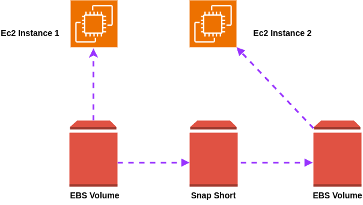

Step-by-Step Guide for Managing EBS Volumes Ubuntu EC2 Instance

# Step-by-Step Guide for Managing EBS Volumes on Ubuntu EC2 Instance

**Step 1:** Create an EC2 Instance
- **Name**: `prod-web-server1`

**Step 2:** Create an EBS Volume
- **Tag**: `Name: prod-web-server1-volume`

**Step 3:** Attach the `prod-web-server1-volume` EBS Volume to the EC2 Instance

**Step 4:** Connect to EC2 Instance via aws console or SSH and Prtition the volume and attached into EC2 Instance
1. **`sudo lsblk`**  
   Lists all available block devices (disks) and their mount points.

2. **`sudo fdisk -l`**  
   Displays detailed information about all partitions on the system.

3. **`sudo file -s /dev/nvme1n1`**  
   Shows the type of filesystem on the specified device (in this case, `/dev/nvme1n1`).

4. **`sudo mkfs -t xfs /dev/nvme1n1`**  
   Formats the `/dev/nvme1n1` device with the XFS filesystem.

5. **`sudo file -s /dev/nvme1n1`**  
   Verifies the filesystem type on `/dev/nvme1n1` after formatting.

6. **`sudo mkdir /mydata`**  
   Creates a directory `/mydata` where the EBS volume will be mounted.

7. **`sudo mount /dev/nvme1n1 /mydata`**  
   Mounts the `/dev/nvme1n1` volume to the `/mydata` directory.

8. **`df -h`**  
   Displays disk space usage in a human-readable format.

9. **`cd /mydata/`**  
   Changes the current directory to `/mydata`.

10. **`touch task1.txt`**  
    Creates an empty file named `task1.txt` in the `/mydata` directory (using regular user privileges).

11. **`sudo touch task1.txt`**  
    Creates an empty file named `task1.txt` with root privileges.

12. **`sudo touch task2.txt`**  
    Creates an empty file named `task2.txt` with root privileges.


**Step 5:** Increasing the EBS Volume
   Extent the volume and run `sudo xfs_growfs /mydata`

**Step 6:** Creating the Snapshot of the EBS 

**Step 7:** Create another EC2 Instance

**Step 8:** Make volume from that Snapshot of EBS Volume of `prod-web-server1-volume`

**Step 9:** Attach volume into 2nd EC2 Intance and mount volume to EC2 Instance (Don't need Format)

**Note:** For parmanent mount you have top entry on `/etc/fstabe`

Identify the Volume and Filesystem.\
`lsblk`

Use the blkid command to retrieve the UUID of the volume.\
`sudo blkid /dev/nvme1n1`

Edit the /etc/fstab file to configure the volume to mount automatically at boot.\
`sudo nano /etc/fstab`

Add an entry for your EBS volume. For an xfs filesystem, the entry might look like this.\
`UUID=adf79440-2152-455b-8016-6e2b0a52adf1 /mydata xfs defaults,nofail 0 2`

Test and Reload Configuration.
```
sudo systemctl daemon-reload
sudo mount -a
```

Check if the volume is mounted.\
`df -h`


<p align="center">
  
  <br/>
  Pic: EBS Volume
</p>