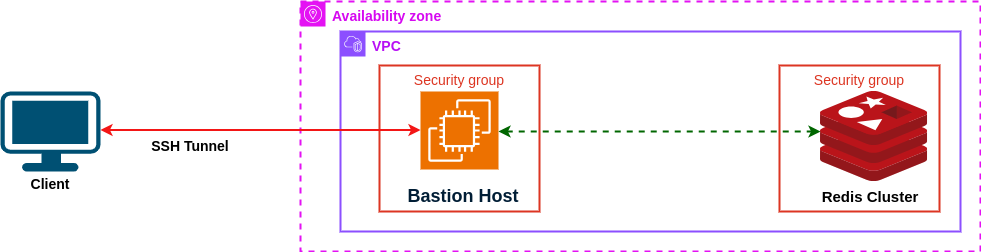
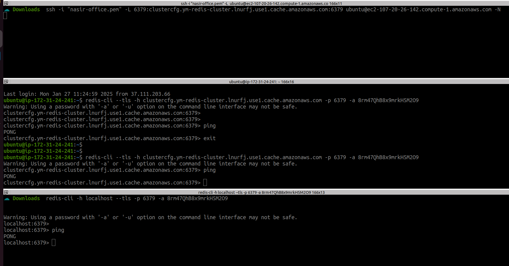

# Access AWS ElastiCache Redis from Your Local Machine

To access an **AWS ElastiCache Redis** instance from your local machine, you can use **SSH tunneling** through an EC2 instance. Below are the steps to securely access the Redis instance.


<p align="center">
  
  <br/>
  Pic: Architecture to connect AWS ElastiCache Redis from Local
</p>

## Steps to Access ElastiCache Redis from Your Local Machine:

### 1. **Create an EC2 Instance (if you don't have one already)**

- Ensure that you have an EC2 instance running in the same **VPC** as your ElastiCache Redis cluster.
- The EC2 instance should have **SSH access** from your local machine.
- **Security group** of the EC2 instance should allow inbound SSH (port 22) from your local machine.

### 2. **Configure Security Groups**

**2.1 For ElastiCache Redis:**
  - Ensure that the **security group** attached to your ElastiCache cluster allows inbound traffic from the EC2 instance on port `6379`.
  
**2.2 For EC2 Instance:**
  - The **security group** of the EC2 instance should allow **SSH traffic** from your IP address on port `22`.

### Connect to EC2 Instance and check redis from EC2 Instance

Connec to EC2 Instance.
```
ssh -i "nasir-ec2.pem" ubuntu@ec2-107-20-26-142.compute-1.amazonaws.com
```
Installs the Redis CLI tools package, which includes the redis-cli command.
```
sudo apt update 
sudo apt install redis-tools -y

```

Connect to AWS Redis Cluster.
```
redis-cli --tls -h clustercfg.ym-redis-cluster.lnurfj.use1.cache.amazonaws.com -p 6379 -a your-redis-password

ping
```


### 3. **Set up an SSH Tunnel**

To securely access Redis through the EC2 instance, we will set up an SSH tunnel that forwards a local port (`6379`) to the ElastiCache Redis endpoint.

**3.1 SSH Tunnel Command:**
```
ssh -i "nasir-ec2.pem" -L 6379:clustercfg.ym-redis-cluster.lnurfj.use1.cache.amazonaws.com:6379 ubuntu@ec2-107-20-26-142.compute-1.amazonaws.com -N
```
**Explanation**
- ssh: Initiates an SSH connection.
- i "nasir-ec2.pem": Specifies the private key file (nasir-ec2.pem) for authentication.
- L 6379:clustercfg.ym-redis-cluster.lnurfj.use1.cache.amazonaws.com:6379: 
- - Forwards the local port 6379 on your machine to the port 6379 on the AWS ElastiCache Redis endpoint clustercfg.ym-redis-cluster.lnurfj.use1.cache.amazonaws.com. This allows you to access the Redis cluster locally as if it were running on your machine.
- ubuntu@ec2-107-20-26-142.compute-1.amazonaws.com: Specifies the bastion host's public IP/DNS and the username (ubuntu) to connect to the EC2 instance.
- N: Instructs SSH not to execute remote commands; the session is used exclusively for port forwarding.

**3.2 Now Connect Redis Cluster from Local machine**
```
redis-cli -h 127.0.0.1 -p 6379 -a your-redis-password --timeout 600

```
**3.3 Check Redis replay do ping if everything ok, you will get back replay PONG**

```
ping
```

<p align="center">
  
  <br/>
  Pic: SSH Tunnel Connect to AWS ElastiCache Redis from Local
</p>

🎉 Congratulations! 🎉

You have successfully connected to your AWS ElastiCache Redis Cluster! 🚀

Your setup is now ready to handle Redis operations securely and efficiently. Test it further with commands like PONG to ensure smooth functionality.

Happy caching! 😊